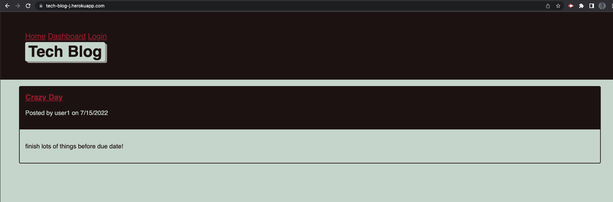
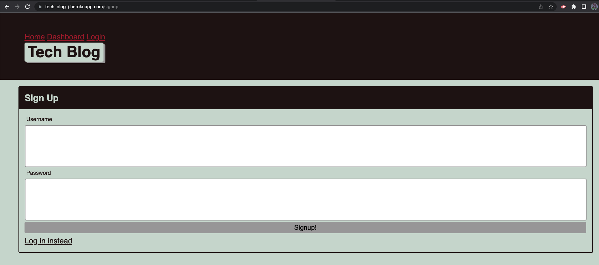
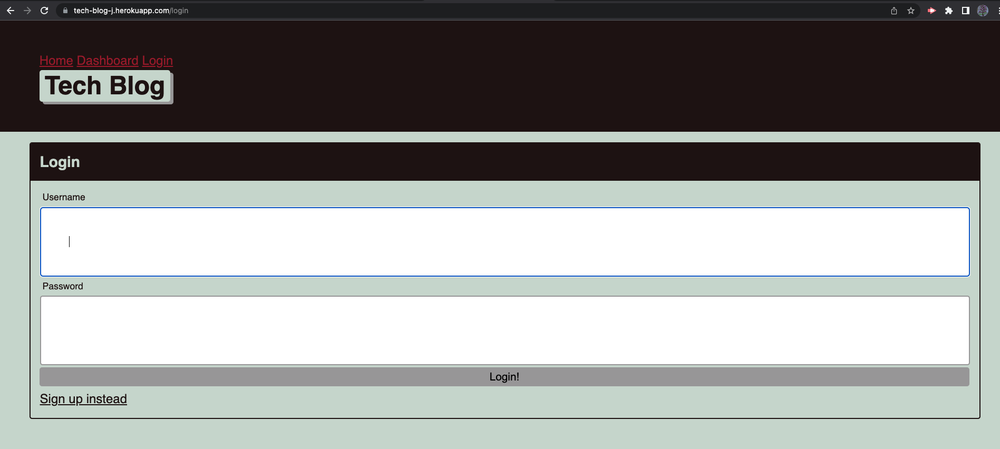
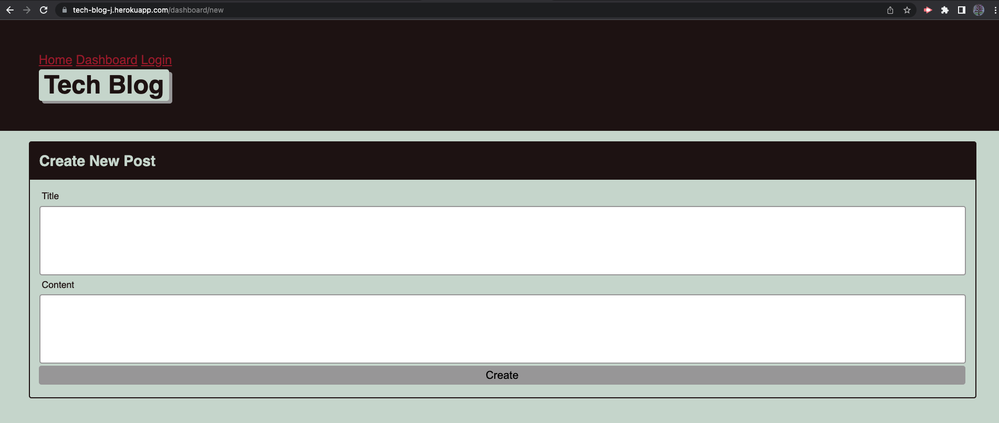
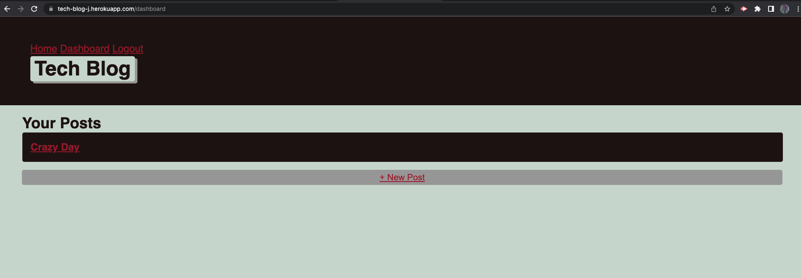

# Tech_Blog
## Table of Contents
- Description
- Installation
- Usage
- Contribution
- License & Copyright
- Questions

## Description:
This application is a CMS-style blog site similar to a Wordpress site, where users can publish their blog posts and comment on others as well. 

## Installation:
N/A

## Usage:
Homework

## Contribution:
N/A

## License & Copyright:
Copyright © 2022 <Jing Li>. 
Licensed under the [MIT License](LICENSE).

## Questions:

- GitHub: https://github.com/Jean424?tab=repositories
- Email: jeanlee.jingli@icloud.com

## Link
- Link to the heroku: https://tech-blog-j.herokuapp.com/
- Screen_Shot of homepage:
- Screen_Shot of signup:
- Screen_Shot of login:
- Screen_Shot of create_new_post:
- Screen_Shot of new_posts: